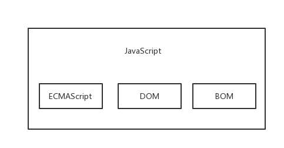

## ECMAScript

### 1. ECMAScript 与 Javascript 的关系

谈到 ECMAScript ，很容易就想到他与 JavaScript 之间的关系。首先说下 JavaScript 的组成部分：一个完整的 JavaScript 实现应该由下列三个不同的部分组成：

* 核心（ECMAScript）
* 文档对象模型（DOM）
* 浏览器对象模型（BOM）

从上节可知道，ECMA 发布 262 号标准文件（ECMA-262）的第一版，规定了浏览器脚本语言的标准，并将这种语言称为 ECMAScript，这个版本就是 1.0 版。该标准从一开始就是针对 JavaScript 语言制定的，但是之所以不叫 JavaScript，有两个原因。一是商标，Java 是 Sun 公司的商标，根据授权协议，只有 Netscape 公司可以合法地使用 JavaScript 这个名字，且 JavaScript 本身也已经被 Netscape 公司注册为商标。二是想体现这门语言的制定者是 ECMA，不是 Netscape，这样有利于保证这门语言的开放性和中立性。因此，ECMAScript 和 JavaScript 的关系是，前者是后者的标准，后者是前者的一种实现（另外的 ECMAScript 方言还有 Jscript 和 ActionScript），日常场合，这两个词是可以互换的。

###  2. ECMAScript 与浏览器
由 ECMA-262 定义的 ECMAScript 与 Web浏览器没有依赖关系。实际上，这门语言本身并不包含输入和输出定义。ECMA-262 定义的只是这门语言的基础，而在此基础之上可以构建更完善的脚本语言。我们常见的 Web 浏览器只是 ECMAScript 实现可能的宿主环境之一。宿主环境不仅提供基本的 ECMAScript 实现，同时也会提供该语言的扩展，以便语言与环境之间对接交互。而这些扩展——如DOM，则利用 ECMAScript 的核心类型和语法提供更多更具体的功能，以便实现针对环境的操作。其他宿主环境包括 Node（一种服务端 JavaScript 平台）和 Adobe Flash。

既然 ECMA-262 标准没有参照 Web 浏览器，那它都规定了些什么内容呢？大致说来，它规定了这门语言的下列组成部分：
* 语法
* 类型
* 语句
* 关键字
* 保留字
* 操作符
* 对象

ECMAScript 就是对实现该标准规定的各个方面内容的语言的描述。JavaScript 实现了 ECMAScript，ActionScript 同样也实现了 ECMAScript。