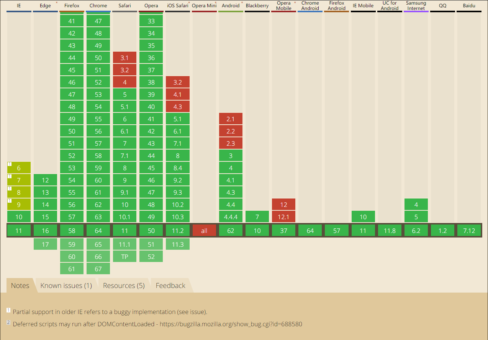
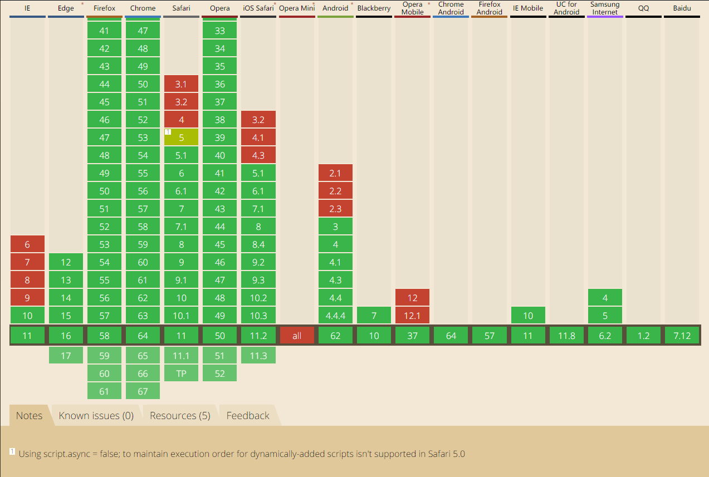

# 谈谈 `<script>` 标签加载顺序的问题

> 这篇文章比较长，如果你耐心读完了，我会感谢你愿意在这篇文章上花费时间，也希望你有收获。


其实说起`<script>`，几乎搞前端的都知道他的作用：引入 `JavaScrit` 代码。没错，这就是`<script>`被创建的最初原因。`<script>`标签出现的很早，这个元素是由 Netscape 创造，并在 Netscape Navigator 2中首先实现。后来，这个元素被加入到正式的 HTML 规范中。

> `JavaScript` 的诞生离不开 Netscape ，`JavaScript` 是由 Netscape 公司的布兰登·艾奇（Brendan Eich）在 1995 年开发的一种脚本语言，`JavaScript` 的第一个版本 JavaScript 1.0 就在 Netscape Navigator 2 实现。

### 1. `<script>` 拥有的属性
* **async**：可选，表示应该立即下载脚本，但不应妨碍页面中的其他操作，比如下载其他资源或等待加载其他脚本。只对外部脚本文件有效。
* **charset**：可选。表示通过 src 属性指定的代码的字符集。由于大多数浏览器会忽略它的值，因此这个属性很少有人用。
* **defer**：可选。表示脚本可以延迟到文档完全被解析和显示之后再执行。只对外部脚本文件有效。IE7 及更早版本对嵌入脚本也支持这个属性。
* **language**： 已废弃。原来用于表示编写代码使用的脚本语言（如 JavaScript 、 JavaScript1.2 或 VBScript ）。大多数浏览器会忽略这个属性，因此也没有必要再用了。
* **src**：可选。表示包含要执行代码的外部文件。
* **type**：可选。可以看成是 language 的替代属性；表示编写代码使用的脚本语言的内容类型（也称为 MIME 类型）。虽然 text/javascript 
 和 text/ecmascript 都已经不被推荐使用，但人们一直以来使用的都还是 text/javascript 。实际上，服务器在传送 JavaScript 文件时使用的
 MIME 类型通常是 application/x–javascript ，但在 type 中设置这个值却可能导致脚本被忽略。另外，在非IE浏览器中还可以使用以下值： 
 application/javascript 和 application/ecmascript 。考虑到约定俗成和最大限度的浏览器兼容性，目前 type 属性的值依旧还是
 text/javascript 。不过，这个属性并不是必需的，如果没有指定这个属性，则其默认值仍为text/javascript 。

> 在以上属性中 **async**属性是 HTML5 中的新属性。

### 2. 引入方式 `JavaScript` 的两种方式
#### 内联形式
这种方式指的是在 `html `文件中，添加一个`<script></scritp>`标签，然后将 `JavaScript`代码直接写在里面，如：
``` html
<!DOCTYPE html>
<html lang="en">

<head>
  <meta charset="UTF-8">
  <meta name="viewport" content="width=device-width, initial-scale=1.0">
  <meta http-equiv="X-UA-Compatible" content="ie=edge">
  <title>script 标签</title>
  <script type="text/javascript">
    console.log('内联 JavaScript');
  </script>
</head>

<body>
  <!-- content -->
</body>

</html>
```
#### 外置形式
外置形式是将 `JavaScript` 代码写在外部的一个文件里面，在 `html` 文件中通过 `<script>` 标签的 `src` 属性引入,如：
``` httml
<!DOCTYPE html>
<html lang="en">

<head>
  <meta charset="UTF-8">
  <meta name="viewport" content="width=device-width, initial-scale=1.0">
  <meta http-equiv="X-UA-Compatible" content="ie=edge">
  <title>script 标签</title>
</head>

<body>
  <!-- content -->
  <script type="text/javascript" src="./js/01.js"></script>
</body>

</html>
```
#### 两种引入形式的比较
对于这两种方式，毫无疑问，外置形式明显好于内联形式，主要表现为以下方面:

* **可维护性**：外置 Javascript 文件可以被多个页面调用而不用在每个页面上反复地书写.如果有需要改变的部分,你只需要在一处修改即可.所以外置JavaScript 导致代码工作量减少,进而使得维护手续也更加方便。
* **可缓存**：浏览器能够根据具体的设置缓存链接的所有外部 JavaScript文件。也就是说，如果有两个页面都使用同一个文件，那么这个文件只需下载一次。因此，最终结果就是能够加快页面加载的速度。
* **关注点分离**：将 JavaScript 封装在外部的.js文件遵循了关注点分离的法则.总体来说,分离 HTML,CSS 和 JavaScript 从而让我们更容易操纵他们.而且如果是多名开发者同步工作的话,这样也更方便。

因此，在今后的开发中尽量使用外置方式的形式引入`JavaScript`。

### 3.`<script>` 标签加载顺序
如果要谈`<script>` 标签加载顺序问题，首先要谈的就是标签的位置，因为标签的位置对于`JavaScript`加载顺序来说有着很重要的影响。
#### 标签位置
`<script>` 标签的位置有两种，一种是方式`<head>`元素里面，另外一种就是放在`<body>` 元素中页面内容的后面，下面将一一介绍这两种形式：
##### `<script>` 标签放在`<head>`元素里
``` html
<!DOCTYPE html>
<html>

<head>
  <title>Example HTML Page</title>
  <script type="text/javascript" src="example1.js"></script>
  <script type="text/javascript" src="example2.js"></script>
</head>

<body>
  <!-- 这里放内容 -->
</body>

</html>
```
这是一种比较传统的做法，目的就是把所有外部文件（包括 `CSS` 文件和 `JavaScript` 文件）的引用都放在相同的地方.可是，在文档的 <head> 元素中包含所有 JavaScript 文件，意味着必须等到全部 JavaScript 代码都被下载、解析和执行完成以后，才能开始呈现页面的内容（浏览器在遇到 <body> 标签时才开始呈现内容）。对于那些需要很多 JavaScript 代码的页面来说，这无疑会导致浏览器在呈现页面时出现明显的延迟，而延迟期间的浏览器窗口中将是一片空白。很明显，这种做法有着很明显的缺点，特别是针对于现在的移动端来说，如果超过 1s 还没有内容呈现的话将是一种很差的用户体验。为了避免这个问题，就有了下面这种加载方式。

#####  `<script>` 标签放在`<body>` 元素中页面内容的后面
``` html
<!DOCTYPE html>
<html>

<head>
  <title>Example HTML Page</title>
</head>

<body>
  <!-- 这里放内容 -->
  <script type="text/javascript" src="example1.js"></script>
  <script type="text/javascript" src="example2.js"></script>
</body>

</html>
```

对于这种方式，在解析包含的 JavaScript 代码之前，页面的内容将完全呈现在浏览器中。而用户也会因为浏览器窗口显示空白页面的时间缩短而感到打开页面的速度加快了

### 3.延迟加载
`<script>`的每个属性设计来肯定都是有用的，下面我们就来说一说 `defer` 属性。
HTML 4.01 为 `<script>` 标签定义了 `defer` 属性。这个属性的用途是表明脚本在执行时不会影响页面的构造。也就是说，脚本会被延迟到整个页面都解析完毕后再运行。因此，在 `<script>` 元素中设置`defer` 属性，相当于告诉浏览器立即下载，但延迟执行，比如：
``` html
<!DOCTYPE html>
<html lang="en">

<head>
  <meta charset="UTF-8">
  <meta name="viewport" content="width=device-width, initial-scale=1.0">
  <meta http-equiv="X-UA-Compatible" content="ie=edge">
  <title>script 标签</title>
  <script defer="defer" type="text/javascript" src="./js/01.js"></script>
  <script defer="defer" type="text/javascript" src="./js/02.js"></script>
</head>

<body>
  <!-- content -->
  <script type="text/javascript" src="./js/03.js"></script>
</body>

</html>
```
在这个例子中，虽然我们把 `<script>` 元素放在了文档的 `<head>` 元素中，但其中包含的脚本将延迟到浏览器遇到 `</html>` 标签后再执行。HTML5 规范要求脚本按照它们出现的先后顺序执行，因此第一个延迟脚本会先于第二个延迟脚本执行，而这两个脚本会先于 `DOMContentLoaded` 事件执行。在现实当中，延迟脚本并不一定会按照顺序执行，也不一定会在 `DOMContentLoaded` 事件触发前执行，因此最好只包含一个延迟脚本。

> **"在现实当中，延迟脚本并不一定会按照顺序执行，也不一定会在 DOMContentLoaded 事件触发前执行，因此最好只包含一个延迟脚本。"** 这段话是《JavaScript 高级程序设计（第三版）》中的一句话，纠结了很久。自己也尝试写了一些例子，但反馈的结果都是：如果引入的 `<script>`标签 都使用了 `defer` 属性，他们的执行顺序都是按照他们引入的顺序来的。那么作者为什么会写上这一句话呢，个人感觉原因是：即使在 `HTML5` 规范中有这么一条，不一定所有的浏览器厂商都会遵照这个规定，可能某些浏览器厂商并没有实现这个规范，但支持 `defer` 属性，那么就会出现作者所描述的那种情况，所以为了安全起见，在开发中使用一个 `defer` 是非常有必要的。


>还有一点需要注意的是，defer 属性只适用于外部脚本文件。

##### `defer` 的兼容性如下：


从图中可以看出，某些浏览器或者在一些低版本的浏览器中并不支持`defer`属性，因此，把延迟脚本放在页面底部仍然是最佳选择。

### 4.异步加载

说完了延迟加载，然后我们再说下异步加载，即使用 `async`属性。
HTML5 为 `<script`> 元素定义了 `async` 属性。这个属性与 `defer` 属性类似，都用于改变处理脚本的行为。同样与 `defer` 类似， `async` 只适用于外部脚本文件，并告诉浏览器立即下载文件，下载完成后立即执行。但与 `defer`不同的是，标记为 `async` 的脚本并不保证按照指定它们的先后顺序执行。例如：

``` html
<!DOCTYPE html>
<html lang="en">

<head>
  <meta charset="UTF-8">
  <meta name="viewport" content="width=device-width, initial-scale=1.0">
  <meta http-equiv="X-UA-Compatible" content="ie=edge">
  <title>script 标签</title>
  <script async type="text/javascript" src="./js/01.js"></script>
  <script async type="text/javascript" src="./js/02.js"></script>
</head>

<body>
  <!-- content -->
</body>

</html>
```
在以上代码中，可能由于` 01.js` 下载时间比较长，由于两个 `<script`> 标签都是异步执行，互不干扰，因此 `02.js` 可能就会先于 `01.js` 执行。因此，确保两者之间互不依赖非常重要。指定 `async` 属性的目的是不让页面等待两个脚本下载和执行，从而异步加载页面其他内容。为此，建议异步脚本不要在加载期间修改 `DOM`。
##### `async`的兼容性如下：


可以看出 IE9 及以下版本都不支持 `async`属性，因此，把延迟脚本放在页面底部仍然是最佳选择。

### 5. `<script>` 标签加载可视化
下面将用一张图来描述`<script>` 标签三种状态下(**normal**,**defer**,**async**)于`html`加载的关系：


绿色代表`html`解析，淡蓝色代表`html`解析停止，蓝色代表`script`下载，粉红色代表`script`执行。从上图很容易的看出来只要执行`script`,`html`就会停止渲染，除此之外也可以清晰的看出他们之间的加载关系。

### 6. 小结

* 所有 `<script>` 标签引进的 JavaScript 会按照他们引入的顺序依次被解析，在没有使用 defer 或者 async 的情况下，只有在解析完前面 `<script>` 元素中的代码之后，才会开始解析后面 `<script>` 元素中的代码。

* 由于浏览器会先解析完不使用 defer 属性的 `<script>` 元素中的代码，然后再解析后面的内容，所以一般应该把 `<script>` 元素放在页面最后，即主要内容后面， `</body>` 标签前面。

* 使用 defer 属性可以让脚本在文档完全呈现之后再执行,延迟脚本总是按照指定它们的顺序执行。

* 使用 async 属性可以表示当前脚本不必等待其他脚本，也不必阻塞文档呈现。不能保证异步脚本按照它们在页面中出现的顺序执行。

### 7. 结束语

这篇文章是最近读了 《JavaScript 高级程序设计（第三版）》后写的。现在仔细阅读这本书你会发现其中真的有很多的乐趣，这些乐趣来自于你可以更深一步的去了解 `JavaScript`,源自于你原来可以将这个知识点弄得这么的透彻，源自于你也许真的对这么语言有了兴趣。其实我在`github`上创建了一个仓库，用户记录自己在读了这本书中一些知识点以后的一些理解，算是阅读笔记吧，也算是鼓励自己坚持认真的把这本书看完，抵抗一下天生的惰性，如果你也想进一步深刻的了解 `JavaScript`这门语言，[可以点击这里](https://github.com/KuangPF/Professional-JavaScript-for-Web-Developer),大家一起在`github`学习。最后，如果这篇文章有写的不对的地方还望各位大佬指出。
