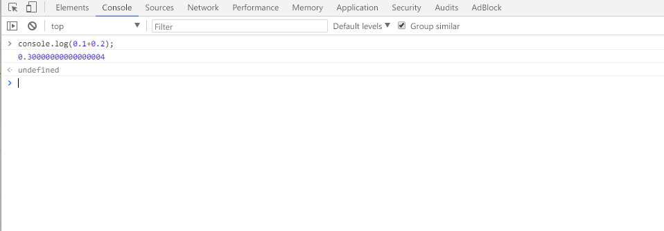

# 数据类型

### 1.基本数据类型

* Boolean
* String
* undefined
* null
* Number
* Object
* Symbol

> 其中前 5 种是 ES5 所拥有的数据类型，而 Symbol 则是 ES6 所定义的一种新的基本数据类型。

### 2.typeof 操作符

typeof 是用来检测给定变量的数据类型，如以下示例：

``` javascript
let message;
let str = 'I am a String';
let fun = function() {
  console.log('I am function');
}

console.log(typeof (message)); // undefined
console.log(typeof str); // string
console.log(typeof fun); // function
console.log(typeof null); // object
console.log(typeof undefined); // undefined 
```

!> typeof 是一个操作符而不是函数，因此例子中的圆括号尽管可以使用，但不是必需的。

!> `typeof null` 返回为 `object`，是因为特殊值 `null` 被认为是一个空的对象引用。

### 3. 有意思的两点

#### 递增与递减

``` javascript
let num1 = 22;
let num2 = 2;
let num3 = --num1 + num2; // 23
let num4 = num1 + num2; // 23
```

``` javascript
let num1 = 22;
let num2 = 2;
let num3 = num1-- + num2; // 24
let num4 = num1 + num2; // 23
```

?> 其实这也没什么意思是吧。。。 233333，从上面的例子可以总结出一句话：**后置递增和递减与前置递增和递减有一个非常重要的区别，即递增和递减操作是在包含它们的语句被求值之后才执行的**。

#### 0.1+0.3=？



**惊不惊喜，意不意外，这是怎么肥事？**

##### 1.简单点可以这样说：

在 JavaScript 中，浮点数值的最高精度是 17 位小数，但在进行算术计算时其精确度远远不如整数。比如0.1 加 0.2的结果不是 0.3，而是 0.30000000000000004，这个小小的舍入误差会导致无法测试特定的浮点数值。

##### 2.复杂点可以这样说：
* js中的数字都是用浮点数表示的，并规定使用IEEE 754 标准的双精度浮点数表示。

* IEEE 754 规定了两种基本浮点格式：单精度和双精度。

  * IEEE单精度格式具有24 位有效数字精度(包含符号号)，并总共占用32 位。

  * IEEE双精度格式具有53 位有效数字精度(包含符号号)，并总共占用64 位。

十进制0.1

* **二进制写法：**0.00011001100110011…(循环0011)

* **尾数为：**1.1001100110011001100…1100（共52位，除了小数点左边的1），指数为-4（二进制移码为00000000010）,符号位为0

* **计算机存储为：**0 00000000100 10011001100110011…11001

* **因为尾数最多52位，所以实际存储的值为:**0.00011001100110011001100110011001100110011001100110011001

十进制0.2

* **二进制写法：**0.0011001100110011…(循环0011)

* **尾数为：**1.1001100110011001100…1100（共52位，除了小数点左边的1），指数为-3（二进制移码为00000000011）,符号位为0

* **计算机存储为：**0 00000000011 10011001100110011…11001

* **因为尾数最多52位，所以实际存储的值为:**0.00110011001100110011001100110011001100110011001100110011

那么两者相加为：
0.00011001100110011001100110011001100110011001100110011001+  0.00110011001100110011001100110011001100110011001100110011    =  0.01001100110011001100110011001100110011001100110011001100

转换成10进制之后得到:0.30000000000000004

##### 3.甩锅型可以这样说

关于浮点数值计算会产生舍入误差的问题，只要是使用基于`IEEE754` 数值的浮点计算的通病，ECMAScript 并非独此一家；其他使用相同数值格式的语言也存在这个问题。不信可以[点这里](http://0.30000000000000004.com/)。


