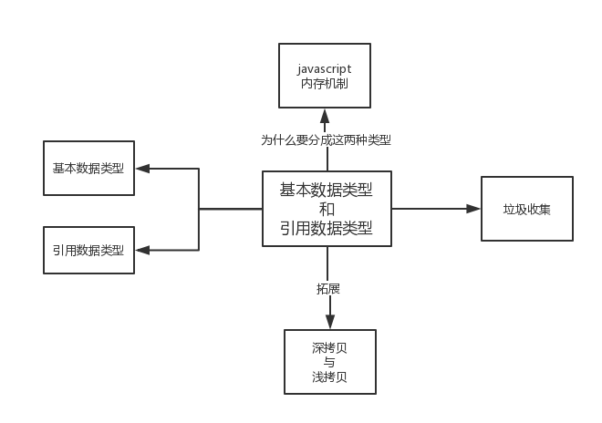
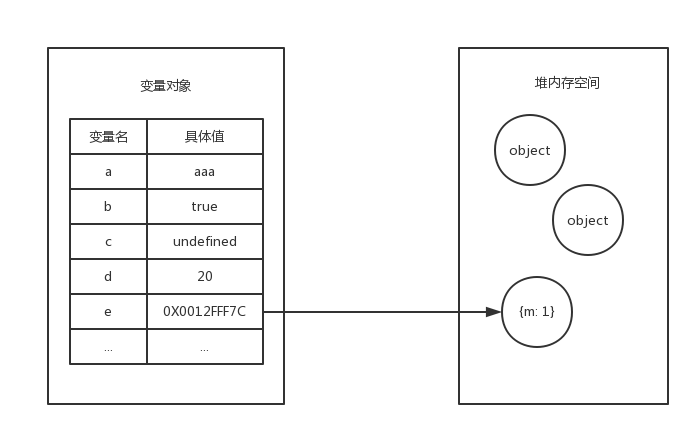

# 基本数据类型和引用数据类型

这篇阅读笔记会讲到 `javascript`基本数据类型和引用数据类型，如果只是将这两个知识点阐述一下，应该不是很复杂，其实这文章的主要目的是通过   **基本数据类型和引用数据类型**  来更加深入的了解一下平时不太关注的`javascript`知识点，从而对`javascript`了解更多一点。先看下面这张图：



从这张图中可以看出来，通过**基本数据类型和引用数据类型**这个知识点引出的其他知识，下面将一一来介绍这些。

> 其实写这篇文章略带一点强迫症，总想把一些问题弄清楚。

在 `Javascript` 中，变量类型分为两种，一种是基本的数据类型，而另外一种就是引用数据类型了。

* 基本数据类型
  * String
  * Number
  * Undefined
  * Null
  * Boolean
  * Symbbol

* 引用类型（Object）
  * Array 
  * Date 
  * RegExp 
  * Function 
  * ...

那么，问题来了：`Javascript`为什么要分基本数据类型和引用数据类型两种呢？这就需要了解一下内存了。

## JavaScript 内存机制

由于JavaScript具有自动垃圾收集机制，因此在开发的时候几乎不用管内存的问题，但如果了解了JavaScript的一些内存机制，在开发中你就会比较清楚地知道代码是怎样运行的了。

与 C/C++ 不同，JavaScript 中并没有严格意义上区分栈内存与堆内存，因此我们可以粗浅的理解为JavaScript的所有数据都保存在堆内存中。先看一个例子：

``` javascript
let a = 'aaa';
let b = true;
let c = undefined;
let d = 20;
let e = {
  m: 1
};
```
这些变量对内存之间的对应关系为：


