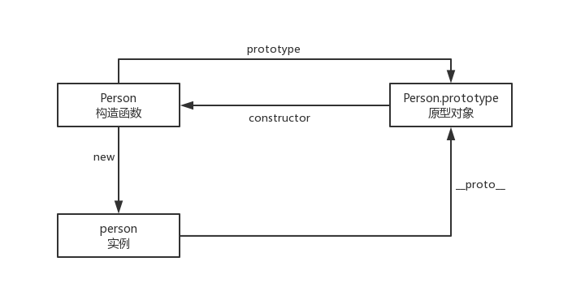
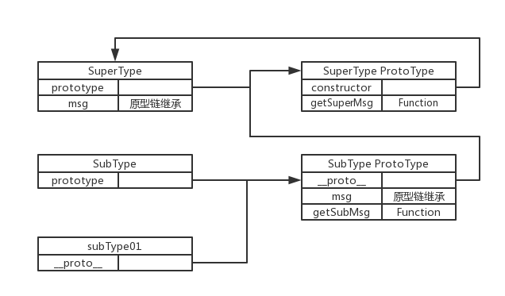

# 继承

这篇文章的主要内容是关于继承方面的知识，其中继承方式有以下几种：

* 原型链继承
* 构造函数继承
* 组合继承
* 原型式继承
* 寄生式继承
* 寄生组合式继承

本文主要讲解前三种继承方式，后两种作为了解，如要深入研究，可自己看小红书。

## 原型链继承

先看一张图：



从这张图可以看出来**构造函数**、**原型对象**和**实例**之间的关系：每个构造函数都有一个原型对象，每个原型对象都包含一个指向构造函数的指针，而实例又包含一个指向构造函数的指针。那么如果让一个原型对象等于一个类型的示例，结果会怎样呢？此时的原型对象将包含一个指向另一个原型对象的指针，相应的另一个原型中也包含一个指向另一个构造函数的指针。假如另一个原型又是另一个类的示例呢，那么上诉关系依然成立，如此层层递进就构成了示例与原型的链条。这就是所谓的原型链。
用原型链实现继承正式利用了原型链的思想，代码如下：

``` javascript
/* 原型链继承 */

function SuperType() {
	this.msg = '原型链继承'
}
SuperType.prototype = {
	getSuperMsg: function () {
		return this.msg;
	}
}

function SubType() {}
SubType.prototype = new SuperType();
SubType.prototype.getSubMsg = function() {
	return this.msg;
}
let subType01 = new SubType();
console.log(subType01.getSuperMsg()); // 原型链继承

```
用一张图来描述`SuperType`、`SubType`和`subType01`之间的关系如下：



从图中应该可以很清楚的看出他们之间的关系，通过实现原型链，从而实现了继承。其实通过原型链实现继承的本质是原型搜索机制：当读取访问一个实例的属性，首先会在实例中搜索该属性，如果没找到，则会继续搜索实例的的原型。在通过原型链实现继承的情况下，搜索过程就得以沿着原型链继续向上。以上面的例子为例，当调用`subType01.getSuperMsg()`时，会经历三个搜索步骤： 

* 搜索实例
* 搜索 SubType.prototype
* 搜索 SuperType.prototype

最后一步才找到了该方法，在找不到属性或方法的情况下，搜索过程总是要一环一环地前行到原型链末端才会停下来。

