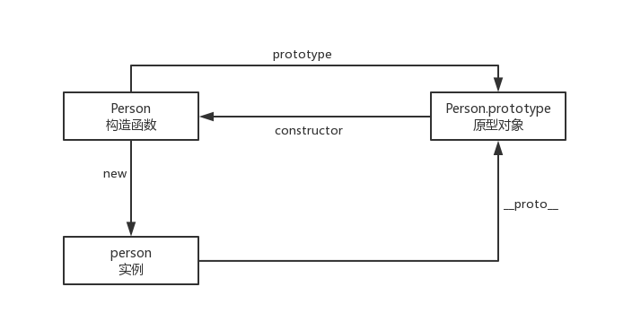

# 继承

这篇文章的主要内容是关于继承方面的知识，其中继承方式有以下几种：

* 原型链继承
* 构造函数继承
* 组合继承
* 原型式继承
* 寄生式继承
* 寄生组合式继承

本文主要讲解前三种继承方式，后两种作为了解，如要深入研究，可自己看小红书。

## 原型链继承

先看一张图：



从这张图可以看出来**构造函数**、**原型对象**和**实例**之间的关系：每个构造函数都有一个原型对象，每个原型对象都包含一个指向构造函数的指针，而实例又包含一个指向构造函数的指针。那么如果让一个原型对象等于一个类型的示例，结果会怎样呢？此时的原型对象将包含一个指向另一个原型对象的指针，相应的另一个原型中也包含一个指向另一个构造函数的指针。假如另一个原型又是另一个类的示例呢，那么上诉关系依然成立，如此层层递进就构成了示例与原型的链条。这就是所谓的原型链。
用原型链实现继承正式利用了原型链的思想，代码如下：

``` javascript
/* 原型链继承 */

function SuperType() {
	this.msg = '原型链继承'
}
SuperType.prototype = {
	getMsg: function () {
		return this.msg;
	}
}

function SubType() {}
SubType.prototype = new SuperType();
let subType01 = new SubType();
console.log(subType01.getMsg());
```
